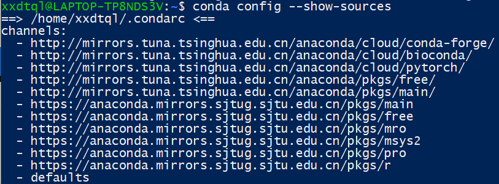
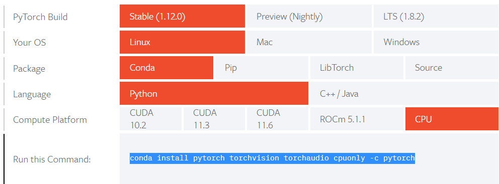

查看wsl2中的ubuntu文件目录**

在windows文件目录中输入命令，如下图所示

```
\\wsl$
```


# Ubuntu-20.04安装Anaconda

## 下载安装

[anaconda官方下载连接](https://www.anaconda.com/products/individual)


往下翻页找到linux版最新版anaconda 4.12.0下载。

然后运行进入下载的目录使用如下命令开始安装，后面的文件名称根据自己下载的版本修改。

```
bash Anaconda3-2022.05-Linux-x86_64.sh
```

一路回车yes，后提示安装vs code。尝试安装提示网络不连通。


使用`conda -V`（V是大写）命令查看安装的conda版本提示`conda: command not found`。则是没有把conda加入系统路径中，使用下列路径把conda加入系统路径。

```bash
export PATH=/home/xxdtql/anaconda3/bin/:$PATH
```


到这里conda下载及配置就完成了

## 使用conda创建新环境

在conda下载好了之后默认是在bash环境中的，我们一般都会创建一个新环境去使用，~~首先先添加一下国内镜像源~~

```
channels:
  - defaults
show_channel_urls: true
default_channels:
  - https://mirrors.tuna.tsinghua.edu.cn/anaconda/pkgs/main
  - https://mirrors.tuna.tsinghua.edu.cn/anaconda/pkgs/r
  - https://mirrors.tuna.tsinghua.edu.cn/anaconda/pkgs/msys2
custom_channels:
  conda-forge: https://mirrors.tuna.tsinghua.edu.cn/anaconda/cloud
  msys2: https://mirrors.tuna.tsinghua.edu.cn/anaconda/cloud
  bioconda: https://mirrors.tuna.tsinghua.edu.cn/anaconda/cloud
  menpo: https://mirrors.tuna.tsinghua.edu.cn/anaconda/cloud
  pytorch: https://mirrors.tuna.tsinghua.edu.cn/anaconda/cloud
  pytorch-lts: https://mirrors.tuna.tsinghua.edu.cn/anaconda/cloud
  simpleitk: https://mirrors.tuna.tsinghua.edu.cn/anaconda/cloud
```

~~使用命令`conda config --show-sources`查看配置的所有源~~



创建一个新的环境，命名为pytorchGpu

```bash
conda create -n pytorchGpu python=3.8
```

~~在环境收集结束后输入y回车就会开始下载，下载完成后使用命令`source activate pytorch`进入创建的新环境。若长时间卡在`Solving environment: /`，打开.condarc文件将`-defaults`那一行删除,且不要验证ssl加上`ssl_verify: false`。~~

使用命令`conda list`可以查看安装的包的信息

最后通过 `source activate pytorch`激活当前环境，`source deactivate`退出当前环境。

然后进入[pytorch官网](https://pytorch.org/get-started/locally/)，选择对应的下载版本

这里需要先查看一下自己服务器的CUDA版本，下载[pytorch](https://so.csdn.net/so/search?q=pytorch&spm=1001.2101.3001.7020)时尽量选择比自己CUDA版本低的或一样的，不然可能会出现兼容问题

使用命令`nvidia-smi`查看CUDA版本，此处报错。


## windows系统下安装英伟达驱动

参考[Windows10/11 WSL2 安装nvidia-cuda驱动 - 哔哩哔哩 (bilibili.com)](https://www.bilibili.com/read/cv14608547)

搜索对应的显卡驱动并安装：[https://developer.nvidia.com/cuda/wsl](https://links.jianshu.com/go?to=https%3A%2F%2Fdeveloper.nvidia.com%2Fcuda%2Fwsl)

尽管wsl2 是ubuntu系统，但官网上说明带有wsl2的官方nvidia驱动是整个过程中唯一要装的GPU驱动**This is the only driver you need to install**

选择我的显卡版本


可以看到我的cuda版本是11.7


## 安装CUDA Toolkit 11.7

[最新版CUDA](https://developer.nvidia.com/cuda-downloads?target_os=Linux&target_arch=x86_64&Distribution=WSL-Ubuntu&target_version=2.0)

[CUDA历史版本(根据个人需要)](https://developer.nvidia.com/cuda-toolkit-archive)


```
wget https://developer.download.nvidia.com/compute/cuda/repos/wsl-ubuntu/x86_64/cuda-wsl-ubuntu.pinsudo mv cuda-wsl-ubuntu.pin /etc/apt/preferences.d/cuda-repository-pin-600sudo apt-key adv --fetch-keys https://developer.download.nvidia.com/compute/cuda/repos/wsl-ubuntu/x86_64/3bf863cc.pubsudo add-apt-repository "deb https://developer.download.nvidia.com/compute/cuda/repos/wsl-ubuntu/x86_64/ /"sudo apt-get updatesudo apt-get -y install cuda
```

```
sudo vim ~/.bashrc #打开环境文件
```

```
# 将这三行复制到底部,根据下载的cuda，变量名可适当更改
export CUDA_HOME=/usr/local/cuda
export PATH=$PATH:$CUDA_HOME/bin
export LD_LIBRARY_PATH=/usr/local/cuda-11.7/lib64${LD_LIBRARY_PATH:+:${LD_LIBRARY_PATH}}
```

`nvcc -V`查看成功状态


## 配置cudnn 11.6

光有cuda，还不足以使我们可以使用电脑的GPU，cuda需要与其配合的使用工具。以方便我们的代码可以被显卡使用并返回结果，这就是cudnn的作用。
[cudnn安装](https://developer.nvidia.com/rdp/cudnn-archive)
需要你登录一个账号，没有的话就注册一个吧。
请安装适合你cuda的cudnn版本。
本人安装的cuda是11.7，cudnn版本为cudnn-linux-x86_64-8.4.0.27_cuda11.6-archive.tar.xz。

```
#以下是安装命令
tar -xvJf cudnn-linux-x86_64-8.4.0.27_cuda11.6-archive.tar.xz
sudo cp -P cudnn-linux-x86_64-8.4.0.27_cuda11.6-archive/lib/libcudnn* /usr/local/cuda-11.6/lib64/
sudo cp cudnn-linux-x86_64-8.4.0.27_cuda11.6-archive/include/cudnn.h /usr/local/cuda-11.6/include/
 
#为更改读取权限：
sudo chmod a+r /usr/local/cuda-11.6/include/cudnn.h
sudo chmod a+r /usr/local/cuda-11.6/lib64/libcudnn*
```


## **安装pytorch **11.6

进入[pytorch官网](https://pytorch.org/get-started/locally/)，选择对应的下载版本。按要求安装cpu版本就行了。这里我想尝试下gpu版本。



~~安装命令注意后面的-c pytorch不要，不然又换回国外源了~~

```bash
conda install pytorch torchvision torchaudio cudatoolkit=11.6 -c pytorch -c conda-forge
```

~~当前通道没有torchaudio和cudatoolkit=11.6则在[anaconda官网]([:: Anaconda.org](https://anaconda.org/))上搜索~~


```bash
conda install -c conda-forge cudatoolkit
```

**\\\wsl$\Ubuntu-20.04\home\xxdtql\anaconda3\envs\pytorch\lib\python3.8\site-packages**为conda包的安装路径

------

命令行安装过慢，手动下载好安装之后使用如下命令进行安装

```bash
conda install --use-local pytorch-1.12.0-py3.8_cuda11.6_cudnn8.3.2_0.tar.bz2(xxxx.tar.bz2是包的绝对路径)
```

## 判断是否安装成功

### 判断pytorch是否安装成功

- 在命令行输入`python`
- 输入`import torch`，没有报错说明安装成功
- torch.__version__

### 检验是否可以使用GPU

输入`torch.cuda.is_available()`，返回true表示可以使用GPU

最后退出 `exit()`


## 其他问题

执行import torch 报错

### ~~报错1~~

`~~OSError: libgomp.so.1: cannot open shared object file: No such file or directory`~~

~~`sudo apt-get install libgomp1~~`

------

### ~~报错2~~


~~缺少gcc环境 首先安装gcc`sudo apt install gcc`，然后`sudo apt-get update`进行更新~~

~~[(19条消息) Linux笔记(2)——导入python库报错“libgomp.so.1: version `GOMP_4.0‘ not found“_HiRadon的博客-CSDN博客~~]~~(https://blog.csdn.net/qq_41705840/article/details/124901316?spm=1001.2101.3001.6650.1&utm_medium=distribute.pc_relevant.none-task-blog-2~default~CTRLIST~default-1-124901316-blog-121636281.pc_relevant_multi_platform_whitelistv1&depth_1-utm_source=distribute.pc_relevant.none-task-blog-2~default~CTRLIST~default-1-124901316-blog-121636281.pc_relevant_multi_platform_whitelistv1&utm_relevant_index=2)~~

### 报错3

OSError: libmkl_intel_lp64.so: cannot open shared object file: No such file or directory

因为我手动通过包文件安装了pytorch，之前的conda install pytorch没有执行成功，所以对应的依赖mkl也没有安装成功。

~~重新运行conda install pytorch便可解决。~~重新运行`conda install pytorch torchvision torchaudio cudatoolkit=11.6 -c pytorch -c conda-forge`。默认安装的是 10.2版本的pytorch，没有GPU

### ubuntu换源

在安装pytorch前先配好

[(19条消息) ubuntu全版本通用换源教程_玄予的博客-CSDN博客_ubuntu换源](https://blog.csdn.net/xuanyu_000001/article/details/122949567)

```
#打开源文件
sudo vim /etc/apt/sources.list

#将原来的内容全部删除
#将源地址加入进去
deb http://mirrors.aliyun.com/ubuntu/ focal main restricted universe multiverse
deb-src http://mirrors.aliyun.com/ubuntu/ focal main restricted universe multiverse

deb http://mirrors.aliyun.com/ubuntu/ focal-security main restricted universe multiverse
deb-src http://mirrors.aliyun.com/ubuntu/ focal-security main restricted universe multiverse

deb http://mirrors.aliyun.com/ubuntu/ focal-updates main restricted universe multiverse
deb-src http://mirrors.aliyun.com/ubuntu/ focal-updates main restricted universe multiverse

deb http://mirrors.aliyun.com/ubuntu/ focal-proposed main restricted universe multiverse
deb-src http://mirrors.aliyun.com/ubuntu/ focal-proposed main restricted universe multiverse

deb http://mirrors.aliyun.com/ubuntu/ focal-backports main restricted universe multiverse
deb-src http://mirrors.aliyun.com/ubuntu/ focal-backports main restricted universe multiverse

#最后更新缓存和升级
sudo apt-get update
sudo apt-get upgrade
```

~~还有`sudo apt install mlocate`~~

## 主要参考博客：

[(19条消息) 【wsl2 windows10/11 安装 配置cuda及pytorch】_fyz_jkl的博客-CSDN博客_cuda pytorch](https://blog.csdn.net/fyz_jkl/article/details/122792853?utm_medium=distribute.wap_relevant.none-task-blog-2~default~baidujs_baidulandingword~default-12-122792853-blog-107641262.wap_blog_relevant_default&spm=1001.2101.3001.4242.7&utm_relevant_index=13)
