# 课程四 第三周 目标检测

## P131 **目标定位** **Object Localization**

前两周介绍了利用CNN进行图像分类。本周课程将继续深入，介绍目标定位和目标检测（包含多目标检测）。

**标准的CNN分类模型**：

对于**目标定位和目标检测问题**，其**模型**如下所示：

**输出除了包含3种分类结果外，还包含了**

- (bx, by)，表示目标中心位置坐标；
- bh和bw，表示目标所在矩形区域的高和宽；
- Pc，表示矩形区域是目标的概率，数值在0～1之间，且越大概率越大。

一般设定图片左上角为原点(0, 0)，右下角为(1, 1)。在模型训练时，bx、by、bh、bw都由人为确定其数值。例如上图中，可得bx=0.5，by=0.7，bh=0.3，bw=0.4。

**输出label可表示为：**

Pc=1: Pc=0:
若Pc=0，表示没有检测到目标，则输出label后面的7个参数都可以忽略。

对于损失函数Loss function，若使用平方误差形式，有两种情况：

​	1.Pc=1 即y1=1

$$
L(\hat y,y)=(\hat y_1-y_1)^2+(\hat y_2-y_2)^2+\cdots+(\hat y_8-y_8)^2
$$

​	2.Pc=0，即y1=0

$$
L(\hat y,y)=(\hat y_1-y_1)^2
$$

除了使用平方误差之外，还可以逻辑回归损失函数，类标签也可以通过softmax输出。**比较而言，平方误差已经能够取得比较好的效果。

## P132 **地标检测 Landmark Detection**

除了使用矩形区域检测目标类别和位置外，我们还可以**仅对目标的关键特征点坐标进行定位**，这些**关键点被称为landmarks**

例如人脸识别，可以对人脸部分特征点坐标进行定位检测，并标记出来，如下图所示：

该网络模型共检测人脸上64处特征点，加上是否为face的标志位，输出label共有64x2+1=129个值。通过检测人脸特征点可以进行情绪分类与判断，或者应用于AR领域等等。

还可以检测人体姿势动作，如下图所示：

## P133 **目标检测 Object Detection**

目标检测的一种简单方法是滑动窗算法。这种算法首先在训练样本集上搜集相应的各种目标图片和非目标图片。注意训练集图片尺寸较小，尽量仅包含相应目标，如下图所示：

然后，使用这些训练集构建CNN模型，使得模型有较高的识别率。

滑动窗算法的**优点是原理简单，且不需要人为选定目标区域**（检测出目标的滑动窗即为目标区域）。

但是其**缺点**也很明显，首先滑动窗的大小和步进长度都需要人为直观设定。滑动窗过小或过大，步进长度过大均会降低目标检测正确率。而且，每次滑动窗区域都要进行一次CNN网络计算，如果滑动窗口和步进长度较小，整个目标检测的算法运行时间会很长。

所以，滑动窗算法虽然简单，但是性能不佳，不够快，不够灵活。

## p134 **滑动窗口的卷积实现 Convolutional Implementation of Sliding Windows**

滑动窗算法可以使用卷积方式实现，**以提高运行速度，节约重复运算成本。**

### 第一步

首先，单个滑动窗口区域进入CNN网络模型时，**包含全连接层，运算速度慢**。那么滑动窗口算法卷积实现的第一步就是将全连接层转变成为卷积层，如下图所示：

**全连接层转变成卷积层方法**：只需要使用与上层尺寸一致的滤波算子（如上图中第一个FC层 给使用5×5×16的滤波算子 × 400个）进行卷积运算即可。最终得到的输出层维度是1 x 1 x 4，代表4类输出值。

### 第二步

单个窗口区域卷积网络结构建立完毕之后，对于待检测图片，即可使用该网络参数和结构进行运算。

下图中

- 第一行是单个检测窗口 输出1×1 × 4 3个分类结果1个Pc 检测是或者不是
- 第二行是测试数据 用14×14在 16×16上步长为2滑动，最后会产生2×2个窗口
- 第三行同理 会产生8×8个窗口[（28-14）/2 +1] = 8

因为有很多重复区域，所以不用单独每滑动一次就进行一次前向传播，可以放在一起卷积，同时计算。

利用卷积操作代替滑动窗算法，则不管原始图片有多大，只需要进行一次CNN正向计算，因为其中共享了很多重复计算部分，这大大节约了运算成本。

如下图左边，每框中一个窗口就计算一次。和右边输入原始图像后直接进行一次正向传播。

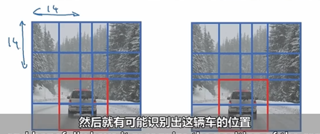

值得一提的是，**窗口步进长度与选择的MAX POOL大小有关**。如果需要**步进长度为4，只需设置MAX POOL为4 x 4即可。**

## p135 **边界框预测 Bounding Box Predictions**

滑动窗口算法有时会出现滑动窗不能完全涵盖目标的问题，如下图蓝色窗口所示。

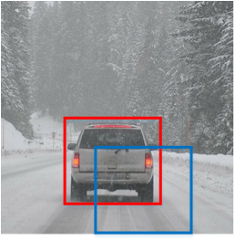

**YOLO（You Only Look Once）**算法可以解决这类问题，生成更加准确的目标区域（如上图红色窗口）。

YOLO算法首先将原始图片分割成n x n网格，每个网格代表一块区域。为简化说明，下图中将图片分成3 x 3网格。

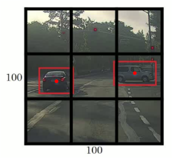

利用上一节卷积形式实现滑动窗口算法的思想，对该原始图片构建CNN网络，得到的的输出层维度为3 x 3 x 8。其中，3 x 3对应9个网格，每个网格的输出包含8个元素：

$$
y=\left [
\begin{matrix}
Pc \\
bx \\
by \\
bh \\
bw \\
c1 \\
c2 \\
c3
\end{matrix}
\right ]
$$

如果**目标中心坐标**

- 不在当前网格内，则当前网格Pc=0；
- 相反，则当前网格Pc=1（即只看中心坐标是否在当前网格内）。

判断有目标的网格中，限定了目标区域。注意当前网格左上角坐标设定为(0, 0)，右下角坐标设定为(1, 1)，范围限定在[0,1]之间，但是可以大于1。因为目标可能超出该网格，横跨多个区域，如上图所示。

目标占几个网格没有关系，目标中心坐标必然在一个网格之内。

划分的网格可以更密一些。网格越小，则**多个目标的中心坐标被划分到一个网格**内的概率就越小

## p136 **交并比 Intersection Over Union**

IoU，即交集与并集之比，可以用来评价目标检测区域的准确性。

红色方框为真实目标区域，蓝色方框为检测目标区域。两块区域的交集为绿色部分，并集为紫色部分。

蓝色方框与红色方框的接近程度可以用IoU比值来定义：

$$
IoU=\frac IU
$$

IoU可以表示任意两块区域的接近程度。IoU值介于0～1之间，且越接近1表示两块区域越接近。

## p137 **非极大值抑制 Non-max Suppression**

YOLO算法中，可能会出现多个网格都检测出到同一目标的情况，例如几个相邻网格都判断出同一目标的中心坐标在其内。

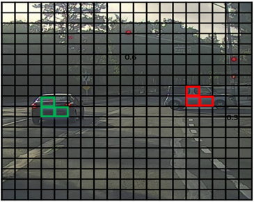

非最大值抑制（Non-max Suppression）

最大值抑制算法的流程：

- **1.丢弃所以Pc值小于0.6的方框**

- **2. 选取Pc值最大的网格如上图右边Pc值为0.9的框框，利用IoU，摒弃与该网格交叠较大的网格；**
- **3. 对剩下的网格，重复步骤2。如上图左边Pc值为0.8的框框，再次利用IoU，摒弃与该网格交叠较大的网格**

如果是检测多个分类 比如行人，车辆，摩托车。则运行三次独立的最大值抑制算法。

## p138 **锚盒 Anchor Boxes**

到目前为止，我们介绍的都是一个网格至多只能检测一个目标。

那对于**多个目标重叠**的情况，例如一个人站在一辆车前面，该如何使用YOLO算法进行检测呢？方法是使用不同形状的Anchor Boxes。

如下图所示，同一网格出现了两个目标：人和车。为了同时检测两个目标，我们可以设置两个Anchor Boxes，Anchor box 1检测人，Anchor box 2检测车。

也就是说，每个网格多加了一层输出。原来的输出维度是 3 x 3 x 8，现在是3 x 3 x 2 x 8（也可以写成3 x 3 x 16的形式）。这里的2表示有两个Anchor Boxes，用来在一个网格中同时检测多个目标。

每个Anchor box都有一个Pc值，**若两个Pc值均大于某阈值，则检测到了两个目标**。

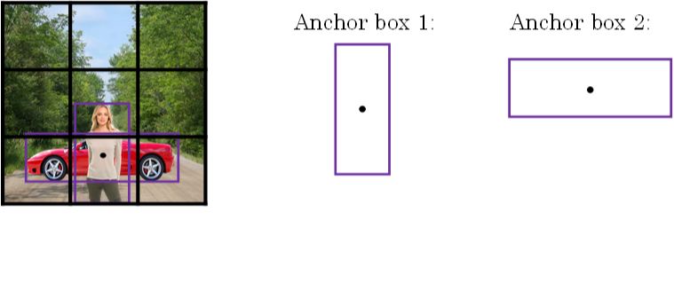

$$
y=\left [
\begin{matrix}
Pc \\
bx \\
by \\
bh \\
bw \\
c1 \\
c2 \\
c3 \\
Pc \\
bx \\
by \\
bh \\
bw \\
c1 \\
c2 \\
c3
\end{matrix}
\right ]
$$

在使用YOLO算法时，**只需对每个Anchor box使用非最大值抑制**即可。Anchor Boxes之间并行实现。

顺便提一下，Anchor Boxes形状的选择**可以通过人为选取**，**也可以使用其他机器学习算法，例如k聚类算法**对待检测的所有目标进行**形状分类**，**选择主要形状作为Anchor Boxes。**

## **P139 YOLO Algorithm**

网络结构如下图所示，包含了两个Anchor Boxes。

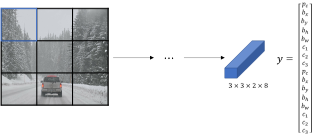

y is 3×3（网格数目 **实际上通常使用19×19**）×2（锚盒）×8（单个锚盒预测结果）

1. **For each grid call, get 2 predicted bounding boxes.每个网格调用都有两个边界框预测（汽车的 行人的）**
2. **Get rid of low probability predictions. 抛弃低可能性的预测**
3. **For each class (pedestrian, car，motorcycle) use non-max suppression to generate final predictions. 对每一类都使用非极大值抑制**

​                  

## p140 **区域推荐网络 Region Proposals 选修**

之前介绍的滑动窗算法会对原始图片的每个区域都进行扫描，即使是一些空白的或明显没有目标的区域。这样会降低算法运行效率，耗费时间

Region Proposals共有三种方法：

- R-CNN: 滑动窗的形式，一次只对单个区域块进行目标检测，运算速度慢。

- Fast R-CNN: 利用卷积实现滑动窗算法，类似第4节做法。

- Faster R-CNN: 利用卷积对图片进行分割，进一步提高运行速度。

比较而言，Faster R-CNN的运行速度还是比YOLO慢一些。

## p141 使用U-Net进行语义分割 Semantic segmentation with U-net

**作用：语义分割(Semantic Segmentation)是图像处理和机器视觉一个重要分支。与分类任务不同，语义分割需要判断图像每个像素点的类别，进行精确分割。语义分割目前在自动驾驶、自动抠图等领域有着比较广泛的应用。**

目前已经有不少其他好用的分割网络：[Mask RCNN](https://link.zhihu.com/?target=https%3A//github.com/matterport/Mask_RCNN/)、[DeepLabv3+](https://link.zhihu.com/?target=https%3A//github.com/tensorflow/models/tree/master/research/deeplab)、[FCIS](https://link.zhihu.com/?target=https%3A//github.com/msracver/FCIS)等。

弄清每个图像中像素的作用，如图所示：

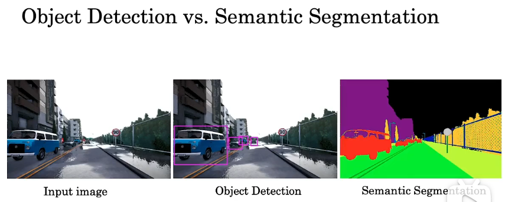

语义分割用途之一是自动驾驶，精准识别各个器官和出问题的器官，比如肿瘤的精确轮廓

**如何实现？**

比如为像素打上标签 1代表是车 0代表不是车，更精细些 2代表房子 3代表路

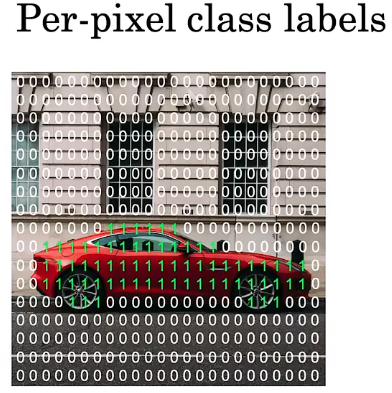

预期输出：

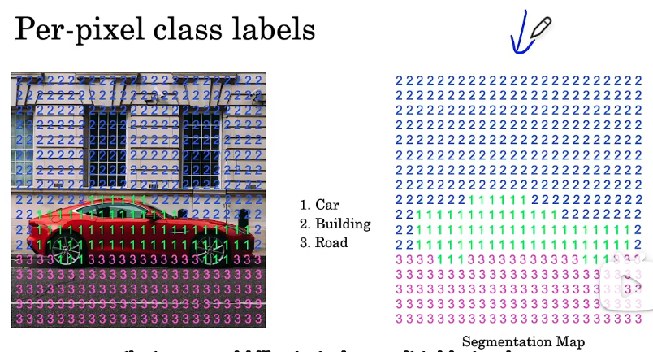

图片输入经过网络后，尺寸先变小最后再恢复，最终得到分割图结果。

尺寸如何恢复要先实现**转置卷积，或反卷积Transpose convolution**

## p142 反卷积  Transpose Convolution 

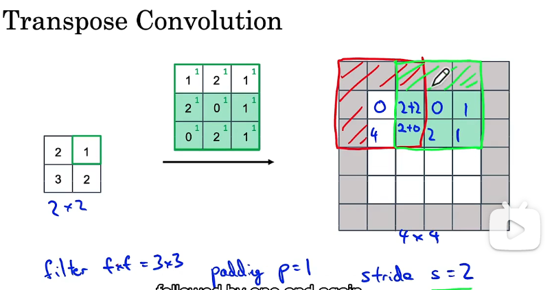

反卷积过程如上图所示：filter 3×3 

在输出上卷积，padding = 1 stride = 2。分别用输入的每个值乘以卷积核每个值后加在输出上。

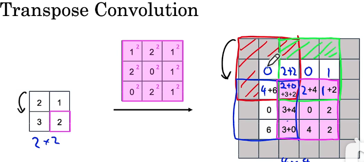

### 疑问？

卷积核大小怎么选的，padding 和 stride怎么选？

## p143 U-Net架构直觉  

## p144 U-Net架构 

没太理解这节，参考其它资料[语义分割网络U-Net详解 - 知乎 (zhihu.com)](https://zhuanlan.zhihu.com/p/389949794)

[ 从零开始的U-net入门_Pterosaur_Zero的博客-CSDN博客_u-net](https://blog.csdn.net/qq_33924470/article/details/106891015)

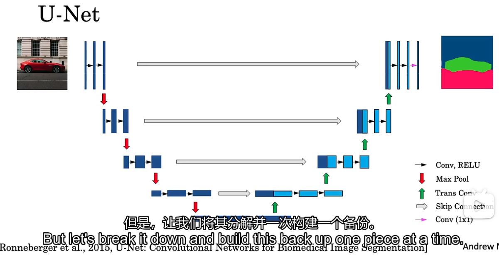

Normal CNN 如上图所示

反转置，未增加高度和宽度，减少了通道数。

然后从左边复制一份激活集到右边，为了保证最后的输出图片结构能和输入的大致一致。

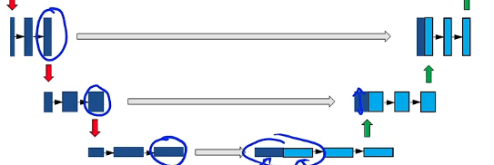

之后开始增加高度和宽度。

最后结果的通道数是要识别的类的类数。

# 课程四 第四周 人脸识别与神经风格迁移

第4节笔记，主要介绍卷积神经网络的特殊应用：人脸识别与风格迁移。

## p145 **什么是人脸识别 What is face recognition**

首先简单介绍一下人脸验证（face verification）和人脸识别（face recognition）的区别。

- **人脸验证：输入一张人脸图片，验证输出与模板是否为同一人，即一对一问题。**
- **人脸识别：输入一张人脸图片，验证输出是否为K个模板中的某一个，即一对多问题。**

一般地，人脸识别比人脸验证更难一些。

因为假设人脸验证系统的错误率是1%，那么在人脸识别中，输出分别与K个模板都进行比较，则相应的错误率就会增加，约K%。模板个数越多，错误率越大一些。

## p146 One Shot Learning

概念：数据库中每个人的训练样本只包含一张照片，然后训练一个CNN模型来进行人脸识别。若数据库有K个人，则CNN模型输出softmax层就是K维的。

**但是One-shot learning的性能并不好**，其包含了两个缺点：

- **每个人只有一张图片，训练样本少**，构建的CNN网络不够健壮。
- **若数据库增加另一个人，输出层softmax的维度就要发生变化**，相当于要重新构建CNN网络，使模型计算量大大增加，不够灵活。

为了解决One-shot learning的问题，先介绍**相似函数（similarity function）**。

**相似函数表示两张图片的相似程度，用d(img1,img2)来表示（difference）**。

- 若d(img1,img2)**较小**，则表示两张图片**相似**；
- 若d(img1,img2)**较大**，则表示两张图片**不相似**。

------

对于人脸识别问题，则**只需计算测试图片与数据库中K个目标的相似函数**，取其中d(img1,img2)最小的目标为匹配对象。

若所有的d(img1,img2)都很大，则表示数据库没有这个人。

## p147  孪生神经网络 Siamese Network

若一张图片经过一般的CNN网络（包括CONV层、POOL层、FC层），最终得到全连接层FC，该FC层可以看成是原始图片的编码encoding，表征了原始图片的关键特征。这个网络结构我们称之为**Siamese network**。

也就是说每张图片经过Siamese network后，**图片由FC层每个神经元来表征**。

建立Siamese network后，两张图片x(1)和x(2)的相似度函数可由各自FC层f(x(1))与f(x(2))之差的范数来表示：

$$
d(x^{(1)},x^{(2)})=||f(x^{(1)})-f(x^{(2)})||^2
$$

不同图片的CNN网络所有结构和参数都是一样的。我们的目标就是利用梯度下降算法，不断调整网络参数，使得属于同一人的图片之间d(x(1),x(2))很小，而不同人的图片之间d(x(1),x(2))很大。

## p148 三元组损失 Triplet Loss

构建人脸识别的CNN模型，需要定义合适的损失函数。

这里引入**Triplet Loss**。

**Triplet Loss**内容：**需要每个样本包含三张图片：靶目标（Anchor）、正例（Positive）、反例（Negative），这就是triplet名称的由来。顾名思义，靶目标和正例是同一人，靶目标和反例不是同一人。**

Anchor和Positive组成一类样本，Anchor和Negative组成另外一类样本。

我们希望上一小节构建的CNN网络输出编码f(A)接近f(P)，即

$||f(A)-f(P)||^2$尽可能小，而$||f(A)−f(N)||^2$尽可能大，数学上满足：

若$f(A)=0$,$f(P)=0$,$f(N)=0$，那么上述不等式也满足。

但是不能保证$||f(A)-f(P)||^2$远小于$||f(A)−f(N)||^2$

我们添加一个**超参数α**，且α>0，对上述不等式做出如下修改：

这里的α也被称为边界margin，类似与支持向量机中的margin。

举个例子，若**d(A,P)=0.5，α=0.2**，则**d(A,N)≥0.7**。

### Loss Function

接下来，我们根据A，P，N三张图片，就可以定义Loss function为：
$$
L(A,P,N)=max(||f(A)−f(P)||^2−||f(A)−F(N)||^2+α, 0)
$$
相应地，对于m组训练样本，cost function为：

$$
J=\sum_{i=1}^mL(A^{(i)},P^{(i)},N^{(i)})
$$

------

### 补充：

1. 关于训练样本，必须保证**同一人包含多张照片**，否则无法使用这种方法。**例如10k张照片包含1k个不同的人脸，则平均一个人包含10张照片**。这个训练样本是满足要求的。

2. 然后，就可以使用梯度下降算法，不断训练优化CNN网络参数，让J不断减小接近0。

3. 同一组训练样本，A，P，N的选择尽可能不要使用随机选取方法。

   因为随机选择的A与P一般比较接近，A与N相差也较大，毕竟是两个不同人脸。

   这样的话，也许模型不需要经过复杂训练就能实现这种明显识别，但是抓不住关键区别。

   所以，最好的做法是人为选择**A与P相差较大**（例如换发型，留胡须等），**A与N相差较小**（例如发型一致，肤色一致等）。这种**人为地增加难度和混淆度会让模型本身去寻找学习不同人脸之间关键的差异**，“尽力”让d(A,P)更小，让d(A,N)更大，即让模型性能更好。

   

值得一提的是，现在许多商业公司构建的大型人脸识别模型都需要百万级别甚至上亿的训练样本。如此之大的训练样本我们一般很难获取。但是一些公司将他们训练的人脸识别模型发布在了网上，可供我们使用。

## p149 人脸验证和二进制分类 **Face Verification and Binary Classification**

除了构造triplet loss来解决人脸识别问题之外，还可以使用二分类结构。

做法是**将两个siamese网络组合在一起**，**将各自的编码层输出经过一个逻辑输出单元，该神经元使用sigmoid函数**，**输出1则表示识别为同一人**，**输出0则表示识别为不同人**

每组训练样本包含两张图片，每个siamese网络结构和参数完全相同。这样就把人脸识别问题转化成了一个二分类问题。

引入逻辑输出层参数w和b，输出y^表达式为：

$$
\hat y=\sigma(\sum_{k=1}^Kw_k|f(x^{(i)})_k-f(x^{(j)})_k|+b)
$$

其中参数wk和b都是通过梯度下降算法迭代训练得到。

y^的另外一种表达式为：

$$
\hat y=\sigma(\sum_{k=1}^Kw_k\frac{(f(x^{(i)})_k-f(x^{(j)})_k)^2}{f(x^{(i)})_k+f(x^{(j)})_k}+b)
$$

上式被称为χ方公式，也叫χ方相似度。

------

在训练好网络之后，进行人脸识别的常规方法是**测试图片与模板分别进行网络计算，编码层输出比较，计算逻辑输出单元。**

为了减少计算量，可以使用**预计算的方式在训练时就将数据库每个模板的编码层输出f(x)保存下来**。
因为编码层输出f(x)比原始图片数据量少很多，所以**无须保存模板图片，只要保存每个模板的f(x)即可**，节约存储空间。而且，**测试过程中，无须计算模板的siamese网络，只要计算测试图片的siamese网络**，**得到的f(x(i))直接与存储的模板f(x(j))进行下一步的逻辑输出单元计算即可**，计算时间减小了接近一半。这种方法也可以应用在上一节的triplet loss网络中。

## p150 什么是神经风格迁移 What is neural style transfer 

神经风格迁移是CNN模型一个非常有趣的应用。它可以实现将一张图片的风格“迁移”到另外一张图片中，生成具有其特色的图片

## p151 什么是深度卷积神经网络学习 **What are deep ConvNets learning**

在进行神经风格迁移之前，我们先来从可视化的角度看一下卷积神经网络每一层到底是什么样子？它们各自学习了哪些东西。

随着层数的增加，捕捉的区域更大，特征更加复杂，从边缘到纹理再到具体物体。

## p152 **Cost Function**

风格迁移代价函数：

**神经风格迁移生成图片G的cost function由两部分组成：C与G的相似程度和S与G的相似程度。**

$$
J(G)=\alpha \cdot J_{content}(C,G)+\beta \cdot J_{style}(S,G)
$$

其中，α,β是超参数，用来调整$J_{content}(C,G)$与$J_{style}(S,G)$的相对比重。

神经风格迁移的基本算法流程是：首先令G为随机像素点，然后使用梯度下降算法，不断修正G的所有像素点，使得$J(G)$不断减小，从而使G逐渐有C的内容和G的风格，如下图所示。

## p152 **内容代价函数 Content Cost Function**

先来看$J(G)$的第一部分$J_{content}(C,G)$，它表示内容图片C与生成图片G之间的相似度

使用的CNN网络是之前训练好的模型，例如Alex-Net。C，S，G共用相同模型和参数。

首先，需要选择合适的层数l来计算$J_{content}(C,G)。$

根据上一小节的内容，CNN的每个隐藏层分别提取原始图片的不同深度特征，由简单到复杂。**如果l层数太小，则G与C在像素上会非常接近，没有迁移效果**。**如果l太深，则G上某个区域将直接会出现C中的物体。**

因此，ll既不能太浅也不能太深，一般选择网络中间层。然后比较C和G在l层的激活函数输出  $a^{[l](C)}$ 与 $a^{[l](G)}$ 

相应的$J_{content}(C,G)$的表达式为：

$$
J_{content}(C,G)=\frac12||a^{[l](C)}-a^{[l](G)}||^2
$$

 $a^{[l](C)}$ 与 $a^{[l](G)}$ 越相似，则$J_{content}(C,G)$越小。

方法就是使用梯度下降算法，不断迭代修正G的像素值，使$J_{content}(C,G)$不断减小。
## **P153 风格代价函数Style Cost Function**

什么是图片的风格？利用CNN网络模型，**图片的风格可以定义成第l层隐藏层不同通道间激活函数的乘积（相关性）。**

