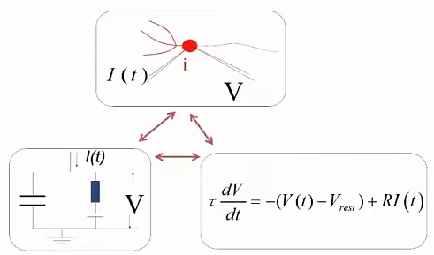
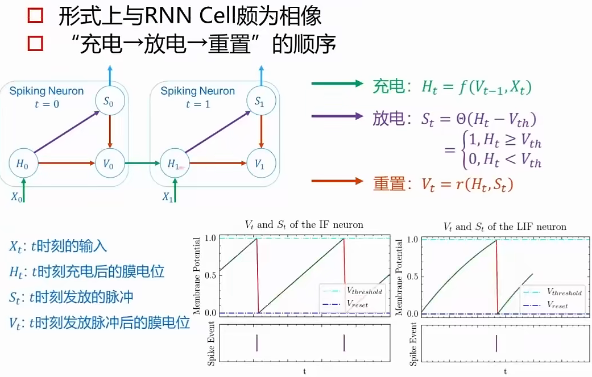
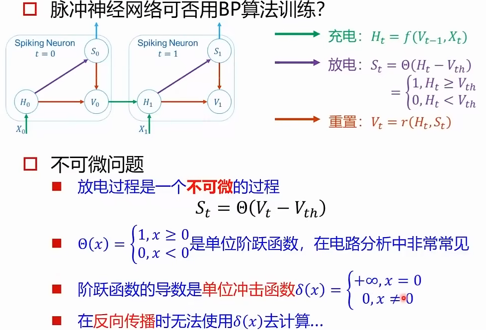
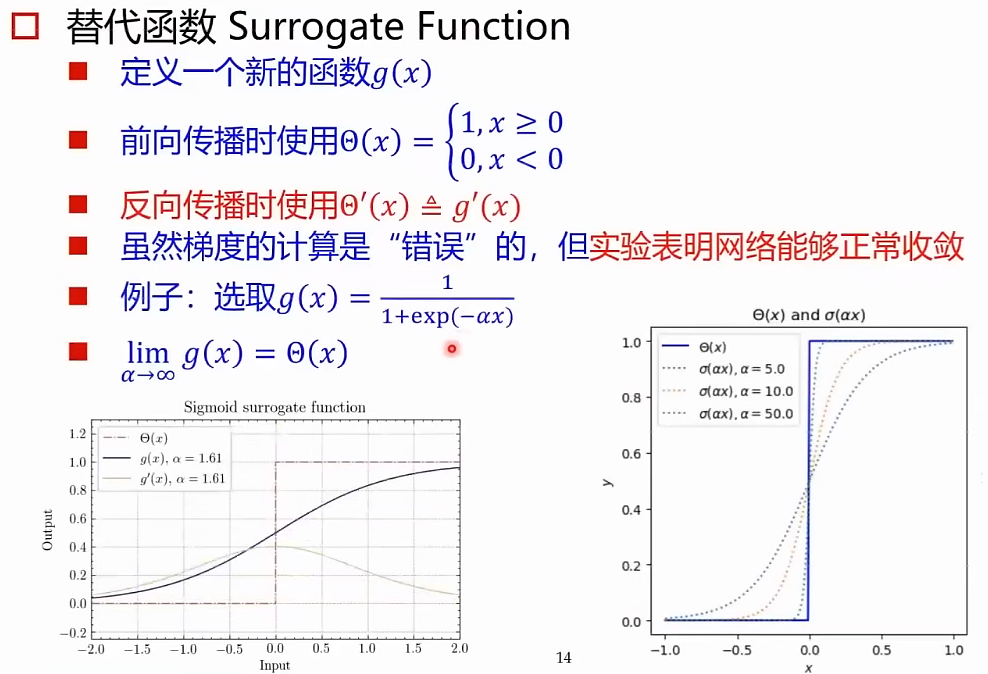
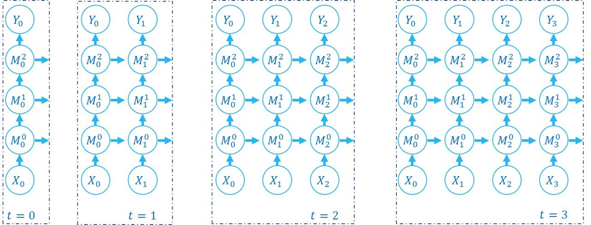
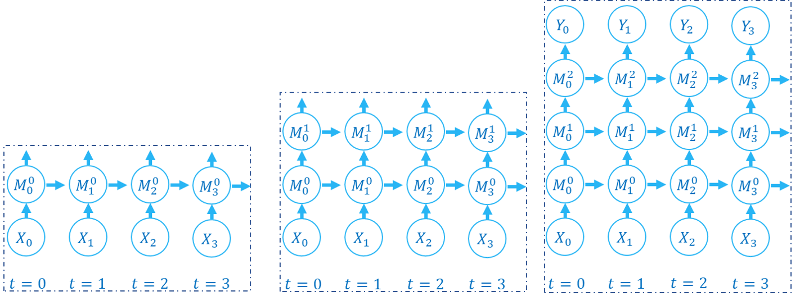

> 本笔记基于spikingjelly**-Latest**教程https://spikingjelly.readthedocs.io/zh_CN/latest
>
> 参考视频：[20220112【脉络分明：脉冲神经网络及其应用】余肇飞：脉冲神经网络学习理论与方法_哔哩哔哩_bilibili](https://www.bilibili.com/video/BV1uT4y127Zr?spm_id_from=333.337.search-card.all.click&vd_source=0ae30021dc2ca3e5667ea157a3453ddb)

# 

# 脉冲神经元模型


脉冲神经元类似人脑神经元，具有低功耗，高效的特点，一个神经元可以和之前几层网络效果一样。

**树突**类似**输入**，**轴突**类似**输出**。**细胞体**类似**处理单元**，对电位进行处理运算，当**电位超过阈值时会发送脉冲信号**，之后再**降回静息reset电位**。

------

## **常用的LIF神经元**：leaky integrate and fire 



**Leaky**：指泄露。当只有一次输入时，不足以让膜电位超过阈值，电压会自动发生泄漏逐渐回落到静息状态。

**Integrate**：指积分。神经元会接收所有与该神经元相连的轴突末端（上一个神经元）到来的脉冲。

**Fire**：指激发。当膜电势超过阈值时，神经元会发送脉冲。发送脉冲后会进入超极化状态，然后是不应期（Refractory Period），在不应期内即使给予刺激也不会反应

**等价公式推导**：

- 将驱动电流分成两部分 $I(t)=I_R+I_C$

- $$
  I(t)=\frac{ V(t)−V_{rest}}R+C\frac{dV(t)}{dt}
  $$

  其中 C是电容， R是电阻 $I_C=\frac{dq}{dt} =C\frac{dV}{dt}$

- 引入时间常数$\tau= RC $，两边同时乘以R得
  $$
  \tau\frac{dV(t)}{dt}=-(V(t)−V_{rest})+RI(t)
  $$

- 

  当电压达到阈值$V_{th}$(threshold)时，重置为$V_{rest}$		

  ------

  补充：若不考虑$-(V(t)−V_{rest})$漏电部分，则为IF神经元，即

$$
\tau\frac{dV(t)}{dt}=RI(t)
$$

上述方程是连续微分方程，在**计算机仿真时被简化为离散的差分方程**


------

## 过程

**单个脉冲神经元运算过程**：


- 接收输入电信号，开始充电，结果是$H_t$
- 判断此时电压$H_t$是否超过阈值$V_th$，超过阈值就发送电信号
- 根据是否发送电信号，进行下一时刻电压设置
  - 超过阈值，重置为静息电位
  - 未超过阈值，设置为$H_t$(硬重置)

**重置方法**： **软重置 减少一个阈值。**这样 1.3和1.2的电位会有区分（假设阈值是1）


------



- $t=0$时刻接收输入$x_0$，输出$y_1$和$v_0$。

- $t=1$时刻接收输入$x_1$和$v_0$，输出$y_2$和$v_1$

  当前时刻的电压**不仅与当前输入电流**有关，**还和上一时刻的电压有关**

------

## 与循环神经网络比较

**单个脉冲神经元等价于一个简化的RNN**，所以由多个脉冲神经元组成时序网络能力更强。

脉冲神经元的时序计算是**异步**的。

------

## 学习方法

- 有监督学习
  - ***代替梯度法 Surrogate Gradient Method 也叫做基于激活的方法***
  - 基于时间的方法 Time-based Method 计算量比较小 但做的不好
  - 使用STDP(Spike-Timing-Dependent Plasticity，脉冲时间依赖可塑性)的反向传播算法
- 无监督学习
  - 基于脉冲的EM（期望最大的）算法 Spike-based EM
- 奖励学习
  - 策略梯度模型 Policy Gradient Models
  - Phenomenological Models
  - 时序差分学习 Temporal-Difference Learning
- ***ANN-SNN（迁移学习）***

代替梯度法  和  ANN-SNN比较常用

------

### 代替梯度法

**存在问题**：单个脉冲神经元的计算过程类似一个RNN，但在**放电过程中**存在**不可微问题**。



**解决办法：**使用替代函数 Surrogate Function

例如：使用sigmoid替代函数 代替



目前尚未找到最优的替代函数


# spikingjelly学习笔记

## 老版本迁移

老版本SpikingJelly均指的是版本号 `<=0.0.0.0.12`

### 子包重命名


### 单步多步模块和传播模式

- 在所有模块使用单步模式时，整个网络就可以使用逐步传播；
- 所有模块都使用多步模式时，整个网络就可以使用逐层传播：

`<=0.0.0.0.12` 的老版本SpikingJelly，在默认情况下所有模块都是单步的，除非其名称含有前缀 `MultiStep`。l例如：

```python
from spikingjelly.clock_driven import neuron

lif = neuron.MultiStepLIFNode()
```

**新版的SpikingJelly，则不再使用前缀对单步和多步模块进行区分**，取而代之的是同一个模块，拥有单步和多步两种步进模式，使用 `step_mode` 进行控制。

```python
from spikingjelly.activation_based import neuron

lif = neuron.LIFNode(step_mode='m')# step_mode='s‘是单步模式
```

新版本中，由于单步和多步模块已经融合，可以通过 `spikingjelly.activation_based.functional.set_step_mode` **对整个网络的步进模式进行转换**。

```python
from spikingjelly.activation_based import neuron, layer, functional
# set the network to use layer-by-layer
functional.set_step_mode(net, step_mode='m')
```

## 基本概念

### 基于激活值的表示方法

`spikingjelly.activation_based` 使用取值仅为0或1的张量表示脉冲

```
spike = tensor([0., 0., 0., 1., 1., 0., 1., 0.])
```

### 数据格式

在 `spikingjelly.activation_based` 中，数据有两种格式：

- 单个时刻的数据，其 shape = [N, \*]，其中 `N`是batch维度\*表示任意额外的维度
- 多个时刻的数据，其 shape = [T, N, *]，其中 `T` 是数据的时间维度

### 步进模式

#### 步进模式种类

在 `spikingjelly.activation_based` 中，单步模式(single-step)和多步模式(multi-step)。

- **单步模式下，使用单个时刻的数据**  shape = [N, \*]
- **多步模式下，使用多个时刻的数据**  shape = [T, N, *]

#### 指定步进模式

模块在初始化时可以**指定其使用的步进模式** `step_mode`，也可以在构建后直接进行修改：

```python
net = neuron.IFNode(step_mode='m')#初始化时
# 'm' is the multi-step mode
net.step_mode = 's'          #初始化后
# 's' is the single-step mode
```

#### 单步模式下使用多时刻数据

**单步模式**的模块输入**多个时刻**的数据  shape = [T, N, *]，

- **手动循环 T**

  ```python
  net_s = neuron.IFNode(step_mode='s')
  T = 4, N = 1, C = 3, H = 8, W = 8
  x_seq = torch.rand([T, N, C, H, W])
  y_seq = []
  for t in range(T):
      x = x_seq[t]  # x.shape = [N, C, H, W]
      y = net_s(x)  # y.shape = [N, C, H, W]
      y_seq.append(y.unsqueeze(0))#y.unsqueeze(0)增加一个维度，在第0维前
  print(f'y_seqpre = {y_seq}') #多个张量以逗号隔开
  y_seq = torch.cat(y_seq)#多个张量合并为一个张量
  # y_seq.shape = [T, N, C, H, W]
  ```

- **使用`functional.multi_step_forward`**

  ```python
  net_s = neuron.IFNode(step_mode='s')
  T = 4, N = 1, C = 3, H = 8, W = 8
  x_seq = torch.rand([T, N, C, H, W])
  y_seq = functional.multi_step_forward(x_seq, net_s)
  ```

- **直接将模块设置成多步模块，更为便捷：**

  ```python
  net_m = neuron.IFNode(step_mode='m')
  T = 4, N = 1, C = 3, H = 8, W = 8
  x_seq = torch.rand([T, N, C, H, W])
  y_seq = net_m(x_seq)
  ```

为了保持与老版本SpikingJelly代码的兼容性，所有模块的默认步进模式都是单步。

### 状态的保存和重置

#### 状态的保存

SNN中的神经元其输出 $Y[t]$ 不仅仅与当前时刻的输入$ X[t] $有关，还与上一个时末的状态 $H[t−1] $有关，即 $Y[t]=f(X[t],H[t−1])$ 

- net_s.v  当前时刻电压 
- net_s.v_reset 惊喜电压
- net_s.v_threshold 阈值电压
- net_s.surrogate_function 替代函数

```python
net_s = neuron.IFNode(step_mode='s')
x = torch.rand([4])
y = net_s(x)
```


初始化后，IF神经元层的 `v` 会被设置为0，首次给与输入后 `v` 会自动广播到与输入相同的 `shape`。

#### 状态的重置

若我们给与一个新的输入，则应该先清除神经元之前的状态，让其恢复到初始化状态，可以通过调用模块的 `self.reset()` 函数实现：

还可以通过调用 `spikingjelly.activation_based.functional.reset_net` 将整个网络中的所有有状态模块进行重置。

若网络使用了有状态的模块，在训练和推理时，务必在处理完毕一个batch的数据后进行重置：

```python
from spikingjelly.activation_based import functional
# ...
for x, label in tqdm(train_data_loader):
    # ...
    optimizer.zero_grad()
    y = net(x)
    loss = criterion(y, label)
    loss.backward()
    optimizer.step()

    functional.reset_net(net)
    # Never forget to reset the network!
```

### 传播模式

**逐步传播**



**逐层传播**



- 若网络全部由**单步模块**构成，则整个网络的计算顺序是按照**逐步传播(step-by-step)**的模式进行

  ```python
  for t in range(T):
      x = x_seq[t]
      y = net(x)
      y_seq_step_by_step.append(y.unsqueeze(0))
  
  y_seq_step_by_step = torch.cat(y_seq_step_by_step, 0)
  ```

- 如果网络全部由**多步模块**构成，则按照**逐层传播(layer-by-layer)**

  ```python
  from spikingjelly.activation_based import neuron, functional, layer
  T = 4 N = 2 C = 8
  x_seq = torch.rand([T, N, C]) * 64.
  
  net = nn.Sequential(
      layer.Linear(C, 4),
      neuron.IFNode(),
      layer.Linear(4, 2),
      neuron.IFNode()
  )
  
  functional.set_step_mode(net, step_mode='m')
  with torch.no_grad():
      y_seq_layer_by_layer = x_seq
      #for i in range(net.__len__()):
      #    y_seq_layer_by_layer = net[i](y_seq_layer_by_layer)
      y_seq_layer_by_layer = net(x_seq)#可以不用显示循环直接使用net(x_seq)
  ```

逐步传播和逐层传播，实际上只是计算顺序不同，它们的计算结果是完全相同的

SNN的计算图有2个维度，分别是时间步数和网络深度，网络的传播实际上就是生成完整计算图的过程，正如上面的2张图片所示。实际上，逐步传播是深度优先遍历，而逐层传播是广度优先遍历。

尽管两者区别仅在于计算顺序，但计算速度和内存消耗上会略有区别。

- 在使用**梯度替代法训练**时，通常**推荐使用逐层传播**。在正确构建网络的情况下，逐层传播的并行度更大，**速度更快**
- 在**内存受限**时使用**逐步传播**，**例如ANN2SNN任务**中需要用到非常大的 `T`。因为在逐层传播模式下，对无状态的层而言，真正的 batch size 是 `TN` 而不是 `N` (参见下一个教程)，当 `T` 太大时内存消耗极大

## 包装器

**主要作用：单步模块包装成多步模块，使模型可以对多时刻数据进行处理**

SpikingJelly中主要提供了如下几种包装器：

###  multi_step_forward和MultiStepContainer

- 函数风格的 [`multi_step_forward`](https://spikingjelly.readthedocs.io/zh_CN/latest/sub_module/spikingjelly.activation_based.functional.html#spikingjelly.activation_based.functional.multi_step_forward) 和模块风格的 [`MultiStepContainer`](https://spikingjelly.readthedocs.io/zh_CN/latest/sub_module/spikingjelly.activation_based.layer.html#spikingjelly.activation_based.layer.MultiStepContainer)

  - [`multi_step_forward`](https://spikingjelly.readthedocs.io/zh_CN/latest/sub_module/spikingjelly.activation_based.functional.html#spikingjelly.activation_based.functional.multi_step_forward) 可以将一个单步模块进行多步传播，而 [`MultiStepContainer`](https://spikingjelly.readthedocs.io/zh_CN/latest/sub_module/spikingjelly.activation_based.layer.html#spikingjelly.activation_based.layer.MultiStepContainer) 则可以将一个单步模块包装成多步模块

  - ```python
    from spikingjelly.activation_based import neuron, functional, layer
    x_seq = torch.rand([T, N, C, H, W])
    y_seq = functional.multi_step_forward(x_seq, net_s)#单步模块进行多步传播
    
    net_s.reset()
    
    net_m = layer.MultiStepContainer(net_s)#将一个单步模块包装成多步模块
    z_seq = net_m(x_seq)
    ```

###  seq_to_ann_forward 和SeqToANNContainer

- 函数风格的 [`seq_to_ann_forward`](https://spikingjelly.readthedocs.io/zh_CN/latest/sub_module/spikingjelly.activation_based.functional.html#spikingjelly.activation_based.functional.seq_to_ann_forward) 和模块风格的 [`SeqToANNContainer`](https://spikingjelly.readthedocs.io/zh_CN/latest/sub_module/spikingjelly.activation_based.layer.html#spikingjelly.activation_based.layer.SeqToANNContainer)

  - 无状态的ANN网络层，例如 [`torch.nn.Conv2d`](https://pytorch.org/docs/stable/generated/torch.nn.Conv2d.html#torch.nn.Conv2d)，其本身要求输入单时刻数据，若用于多步模式，则可以用多步的包装器进行包装。但是ANN是不依赖多时刻数据的

  - ```python
    with torch.no_grad():
        x_seq = torch.rand([T, N, C, H, W])
    
        conv = nn.Conv2d(C, 8, kernel_size=3, padding=1, bias=False)
        bn = nn.BatchNorm2d(8)
    
        y_seq = functional.multi_step_forward(x_seq, (conv, bn))
        # y_seq.shape = [T, N, 8, H, W]
    
        net = layer.MultiStepContainer(conv, bn)
        z_seq = net(x_seq)
        # z_seq.shape = [T, N, 8, H, W]
    
        # z_seq 和 y_seq 相同
    ```

  - 但是**ANN的网络层本身不依赖不同时刻的数据**，可以使用函数风格的 [`seq_to_ann_forward`](https://spikingjelly.readthedocs.io/zh_CN/latest/sub_module/spikingjelly.activation_based.functional.html#spikingjelly.activation_based.functional.seq_to_ann_forward) 或模块风格的 [`SeqToANNContainer`](https://spikingjelly.readthedocs.io/zh_CN/latest/sub_module/spikingjelly.activation_based.layer.html#spikingjelly.activation_based.layer.SeqToANNContainer) 进行包装。

    `seq_to_ann_forward` 将 `shape = [T, N, *]` 的数据首先变换为 `shape = [TN, *]`，再送入无状态的网络层进行计算，输出的结果会被重新变换为 `shape = [T, N, *]`。不同时刻的数据是并行计算的，因而速度更快

    ```python
    with torch.no_grad():
        x_seq = torch.rand([T, N, C, H, W])
    
        conv = nn.Conv2d(C, 8, kernel_size=3, padding=1, bias=False)
        bn = nn.BatchNorm2d(8)
    
        y_seq = functional.multi_step_forward(x_seq, (conv, bn))#按多步
        # y_seq.shape = [T, N, 8, H, W]
    
        net = layer.MultiStepContainer(conv, bn)
        z_seq = net(x_seq)
        # z_seq.shape = [T, N, 8, H, W]
    
        # z_seq is identical to y_seq
    
        p_seq = functional.seq_to_ann_forward(x_seq, (conv, bn))
        # p_seq.shape = [T, N, 8, H, W]
    
        net = layer.SeqToANNContainer(conv, bn)
        q_seq = net(x_seq)
        # q_seq.shape = [T, N, 8, H, W]
    
        # q_seq is identical to p_seq, and also identical to y_seq and z_seq
    ```

  常用的网络层，在 [`spikingjelly.activation_based.layer`](https://spikingjelly.readthedocs.io/zh_CN/latest/sub_module/spikingjelly.activation_based.layer.html#module-spikingjelly.activation_based.layer) 已经定义过，**更推荐使用 `spikingjelly.activation_based.layer`中的网络层**，**不建议使用 `SeqToANNContainer`手动包装**。尽管layer中的网络层是用包装器包装 forward 函数实现的。

  **spikingjelly.activation_based.layer中的网络层优势**在于：

  - 支持单步和多步模式，而 [`SeqToANNContainer`](https://spikingjelly.readthedocs.io/zh_CN/latest/sub_module/spikingjelly.activation_based.layer.html#spikingjelly.activation_based.layer.SeqToANNContainer) 和 [`MultiStepContainer`](https://spikingjelly.readthedocs.io/zh_CN/latest/sub_module/spikingjelly.activation_based.layer.html#spikingjelly.activation_based.layer.MultiStepContainer) 包装的层，只支持多步模式
  - 包装器会使得 `state_dict` 的 `keys()` 也增加一层包装，给加载权重带来麻烦

  `MultiStepContainer` 和 `SeqToANNContainer`都是只支持多步模式的，不允许切换为单步模式。

###  StepModeContainer

- 对单步模块进行包装以进行单步/多步传播的 [`StepModeContainer`](https://spikingjelly.readthedocs.io/zh_CN/latest/sub_module/spikingjelly.activation_based.layer.html#spikingjelly.activation_based.layer.StepModeContainer)

  类似于融合版的 [`MultiStepContainer`](https://spikingjelly.readthedocs.io/zh_CN/latest/sub_module/spikingjelly.activation_based.layer.html#spikingjelly.activation_based.layer.MultiStepContainer) 和 [`SeqToANNContainer`](https://spikingjelly.readthedocs.io/zh_CN/latest/sub_module/spikingjelly.activation_based.layer.html#spikingjelly.activation_based.layer.SeqToANNContainer)，可以**用于包装无状态或有状态的单步模块**，需要在包装时指明**是否有状态（数据是否是多时刻数据）**，但此**包装器还支持切换单步和多步模式**。

  包装无状态层：

  ```python
  with torch.no_grad():
      x_seq = torch.rand([T, N, C, H, W])
      net = layer.StepModeContainer(
          False,#无状态
          nn.Conv2d(C, C, kernel_size=3, padding=1, bias=False),
          nn.BatchNorm2d(C),
      )
      net.step_mode = 'm'
      y_seq = net(x_seq)
      # y_seq.shape = [T, N, C, H, W]
  
      net.step_mode = 's'
      y = net(x_seq[0])
      # y.shape = [N, C, H, W]
  ```

  包装有状态层：

  ```python
  with torch.no_grad():
      x_seq = torch.rand([T, N, C, H, W])
      net = layer.StepModeContainer(
          True,#有状态
          neuron.IFNode()
      )
      net.step_mode = 'm'
      y_seq = net(x_seq)
      # y_seq.shape = [T, N, C, H, W]
      functional.reset_net(net) #记得重置
  
      net.step_mode = 's'
      y = net(x_seq[0])
      # y.shape = [N, C, H, W]
      functional.reset_net(net)
  ```

  使用 `set_step_mode`改变 `StepModeContainer`是安全的，**只会改变包装器本身的 `step_mode`，而包装器内的模块仍然保持单步：**

  ```python
  with torch.no_grad():
      net = layer.StepModeContainer(
          True,
          neuron.IFNode()
      )
      functional.set_step_mode(net, 'm')
      print(f'net.step_mode={net.step_mode}') #输出net.step_mode=m
      print(f'net[0].step_mode={net[0].step_mode}')#输出net[0].step_mode=s
  ```

### **什么时候使用Container**：

- 如果**模块本身就支持单步和多步模式**的切换，**则不推荐使用 MultiStepContainer**或 **StepModeContainer**对其进行包装。因为包装器使用的多步前向传播，可能不如模块自身定义的前向传播速度快。

- 通常需要用到 MultiStepContainer 或 StepModeContainer的**是一些没有定义多步的模块**，**例如一个在 `torch.nn` 中存在，但在 `spikingjelly.activation_based.layer` 中不存在的网络层。**

## 神经元

主要概念部分：[参考本文第一节 脉冲神经元模型](#脉冲神经元模型)

### 代码使用补充：

以 [`spikingjelly.activation_based.neuron.IFNode`](https://spikingjelly.readthedocs.io/zh_CN/latest/sub_module/spikingjelly.activation_based.neuron.html#spikingjelly.activation_based.neuron.IFNode) 为例来介绍脉冲神经元。

- **导入相关的模块**

  ```python
  import torch
  from spikingjelly.activation_based import neuron
  from spikingjelly import visualizing
  from matplotlib import pyplot as plt
  ```

- **新建一个IF神经元层**：`if_layer = neuron.IFNode()`

- **IF神经元层的几个重要构造参数**

  - **if_layer.v** – 神经元的**当前状态（电压）**
  - **if_layer.v_threshold** – 神经元的**阈值电压**
  - **v_reset** – 神经元的**重置电压**
    - 如果不为 `None`，当神经元释放脉冲后，电压会被重置为 `v_reset`；
    - 如果设置为 `None`，则电压会被减去 `v_threshold`
  - **surrogate_function** – **反向传播**时用来**计算脉冲函数梯度**的**替代函数**

- **一层神经元`neuron.IFNode()`的数量是多少**

  对于 `spikingjelly.activation_based.neuron.IFNode`中的绝大多数神经元层，神经元的数量是在初始化或调用 `reset()` 函数重新初始化后，**根据第一次接收的输入的 `shape` 自动决定的**。

- **脉冲神经元也是有状态的，或者说有记忆。**类似RNN中的神经元

  [`spikingjelly.activation_based.neuron`](https://spikingjelly.readthedocs.io/zh_CN/latest/sub_module/spikingjelly.activation_based.neuron.html#module-spikingjelly.activation_based.neuron) 中的神经元都有成员**变量 v**记录**当前状态（电压）**，数学符号记为$V[t]$。      变量调用`if_layer.v`

- **神经元的当前电压的 `shape`：**

  与输入的shape一致

  ```python
  x = torch.rand(size=[2, 3])
  if_layer(x)
  print(f'x.shape={x.shape}, if_layer.v.shape={if_layer.v.shape}')
  # x.shape=torch.Size([2, 3]), if_layer.v.shape=torch.Size([2, 3])
  if_layer.reset()
  #脉冲神经元是有状态的，在输入下一个样本前，一定要先调用 reset() 函数清除之前的状态。
  ```

- $V[t]$ **和输入$ X[t] $的关系**

  对于IF神经元:

  - **连续时间的脉冲神经元的充电方程**为：

  - **使用离散的差分方程**近似连续的微分方程:

    即

- **释放脉冲**

  不同的神经元，充电方程不尽相同。但膜电位超过阈值电压后，释放脉冲，以及释放脉冲后，膜电位的重置都是相同的。因此它们全部继承自 [`spikingjelly.activation_based.neuron.BaseNode`](https://spikingjelly.readthedocs.io/zh_CN/latest/sub_module/spikingjelly.activation_based.neuron.html#spikingjelly.activation_based.neuron.BaseNode)，共享相同的放电、重置方程。

  可以在 [`spikingjelly.activation_based.neuron.BaseNode.neuronal_fire`](https://spikingjelly.readthedocs.io/zh_CN/latest/sub_module/spikingjelly.activation_based.neuron.html#spikingjelly.activation_based.neuron.BaseNode.neuronal_fire) 中找到释放脉冲的代码：

  ```python
  def neuronal_fire(self):
      self.spike = self.surrogate_function(self.v - self.v_threshold)
  ```

  `surrogate_function()` 在**前向传播时是阶跃函数**，只要输入（self.v - self.v_threshold）大于或等于0，就会返回1，否则会返回0。我们将这种元素仅为0或1的 `tensor` 视为脉冲。

- **膜电位重置**

  释放脉冲消耗了神经元之前积累的电荷，因此膜电位会有一个瞬间的降低，即膜电位的重置

  - Hard方式：释放脉冲后，膜电位直接被设置成重置电压：

  - Soft方式：释放脉冲后，膜电位减去阈值电压。

    对于使用Soft方式的神经元，并不需要重置电压 $V_{reset}$ 这个变量。

  [`spikingjelly.activation_based.neuron`](https://spikingjelly.readthedocs.io/zh_CN/latest/sub_module/spikingjelly.activation_based.neuron.html#module-spikingjelly.activation_based.neuron) 中的神经元，在构造函数的参数之一 **v_reset**，**默认为 `1.0` ，表示神经元使用Hard方式；若设置为 `None`，则会使用Soft方式。**

  膜电位重置的代码：

  ```python
  def neuronal_reset(self):
      if self.v_reset is None:
          self.v = self.v - self.spike * self.v_threshold
      else:
          self.v = (1. - self.spike) * self.v + self.spike * self.v_reset
  ```

### 使用cupy后端进行加速

部分神经元在**多步模式下支持 `cupy` 后端**。在 `cupy` 模式下，**前反向传播会使用CuPy进行加速**：

```python
import torch
from spikingjelly.activation_based import neuron
if_layer = neuron.IFNode()
print(f'if_layer.backend={if_layer.backend}')  # if_layer.backend=torch

print(f'step_mode={if_layer.step_mode}, supported_backends={if_layer.supported_backends}') # step_mode=s, supported_backends=('torch',)

if_layer.step_mode = 'm'
print(f'step_mode={if_layer.step_mode}, supported_backends={if_layer.supported_backends}')  # step_mode=m, supported_backends=('torch', 'cupy')

device = 'cuda:0'
if_layer.to(device)
if_layer.backend = 'cupy'  # switch to the cupy backend
print(f'if_layer.backend={if_layer.backend}') # if_layer.backend=cupy

x_seq = torch.rand([8, 4], device=device) #设置输入的device为cupy
y_seq = if_layer(x_seq)
if_layer.reset()
```

### 自定义神经元

在 [`BaseNode`](https://spikingjelly.readthedocs.io/zh_CN/latest/sub_module/spikingjelly.activation_based.neuron.html#spikingjelly.activation_based.neuron.BaseNode) 中可以找到对应的代码，单步模式下的前向传播 `single_step_forward` 函数即是由3个过程组成：

```python
# spikingjelly.activation_based.neuron.BaseNode
def single_step_forward(self, x: torch.Tensor):
    self.neuronal_charge(x) #充电
    spike = self.neuronal_fire()#放电
    self.neuronal_reset(spike)#重置
    return spike
#neuronal_fire 和 neuronal_reset 对绝大多数神经元都是相同的
```

不同的神经元主要是构造函数和充电方程 `neuronal_charge` 不同。

因此，若想实现新的神经元，则**只需要更改构造函数和充电方程**即可。

假设我们构造一种平方积分发放神经元：

```python
import torch
from spikingjelly.activation_based import neuron

class SquareIFNode(neuron.BaseNode):
    def neuronal_charge(self, x: torch.Tensor):
        self.v = self.v + x ** 2
```

[`BaseNode`](https://spikingjelly.readthedocs.io/zh_CN/latest/sub_module/spikingjelly.activation_based.neuron.html#spikingjelly.activation_based.neuron.BaseNode) 继承自 [`MemoryModule`](https://spikingjelly.readthedocs.io/zh_CN/latest/sub_module/spikingjelly.activation_based.base.html#spikingjelly.activation_based.base.MemoryModule)。[`MemoryModule`](https://spikingjelly.readthedocs.io/zh_CN/latest/sub_module/spikingjelly.activation_based.base.html#spikingjelly.activation_based.base.MemoryModule) 默认的多步传播，是使用 `for t in range(T)` 来循环调用单步传播实现的。因此我们定义 `neuronal_charge` 后， `single_step_forward` 就已经是完整的了，进而 `multi_step_forward` 也可以被使用。

使用平方积分发放神经元进行单步或多步传播：

```python
class SquareIFNode(neuron.BaseNode):

    def neuronal_charge(self, x: torch.Tensor):
        self.v = self.v + x ** 2

sif_layer = SquareIFNode()

T = 4 N = 1
x_seq = torch.rand([T, N])
print(f'x_seq={x_seq}')

for t in range(T):
    yt = sif_layer(x_seq[t])
    print(f'sif_layer.v[{t}]={sif_layer.v}')

sif_layer.reset()
sif_layer.step_mode = 'm'
y_seq = sif_layer(x_seq)
print(f'y_seq={y_seq}')
sif_layer.reset()
```

## 梯度替代

主要概念部分：[参考本文第一节 脉冲神经元模型]

替代函数在神经元中被用于生成脉冲， [`BaseNode.neuronal_fire`](https://spikingjelly.readthedocs.io/zh_CN/latest/sub_module/spikingjelly.activation_based.neuron.html#spikingjelly.activation_based.neuron.BaseNode.neuronal_fire) 的源代码：

```python
# spikingjelly.activation_based.neuron
class BaseNode(base.MemoryModule):
    def __init__(..., surrogate_function: Callable = surrogate.Sigmoid(), ...)
    # ...
    self.surrogate_function = surrogate_function
    # ...

    def neuronal_fire(self):
        return self.surrogate_function(self.v - self.v_threshold)
```

### 常用替代函数示例

在 [`spikingjelly.activation_based.surrogate`](https://spikingjelly.readthedocs.io/zh_CN/latest/sub_module/spikingjelly.activation_based.surrogate.html#module-spikingjelly.activation_based.surrogate) 中提供了一些常用的替代函数

**以Sigmoid函数作为替代函数为例**


在`spikingjelly.activation_based.surrogate.Sigmoid`包中

下图展示了原始的Heaviside阶跃函数 `Heaviside`、 `alpha=5` 时的Sigmoid原函数 `Primitive` 以及其梯度 `Gradient` alpha越大越接近Heaviside


**模块风格API用法示例：**

```python
from spikingjelly.activation_based import surrogate

sg = surrogate.Sigmoid(alpha=4.)

x = torch.rand([8]) - 0.5
x.requires_grad = True
y = sg(x)
y.sum().backward()
```

每个替代函数，除了有形如 [`spikingjelly.activation_based.surrogate.Sigmoid`](https://spikingjelly.readthedocs.io/zh_CN/latest/sub_module/spikingjelly.activation_based.surrogate.html#spikingjelly.activation_based.surrogate.Sigmoid) 的**模块风格API**，也提供了形如 [`spikingjelly.activation_based.surrogate.sigmoid`](https://spikingjelly.readthedocs.io/zh_CN/latest/sub_module/spikingjelly.activation_based.surrogate.html#spikingjelly.activation_based.surrogate.sigmoid) **函数风格的API**。

| 模块         | 函数         |
| ------------ | ------------ |
| `Sigmoid`    | sigmoid      |
| `SoftSign`   | soft_sign    |
| `LeakyKReLU` | leaky_k_relu |

**函数风格API的用法示例**：

```python
from spikingjelly.activation_based import surrogate

alpha = 4.
x = torch.rand([8]) - 0.5
x.requires_grad = True
y = surrogate.sigmoid.apply(x, alpha)
y.sum().backward()
```

替代函数通常会有1个或多个控制形状的超参数，例如 `spikingjelly.activation_based.surrogate.Sigmoid`中的 `alpha`。SpikingJelly中替代函数的形状参数，默认情况下是使得替代函数梯度最大值为1，这在一定程度上可以避免梯度累乘导致的梯度爆炸问题。

## 监视器

在 [`spikingjelly.activation_based.monitor`](https://spikingjelly.readthedocs.io/zh_CN/latest/sub_module/spikingjelly.activation_based.monitor.html#module-spikingjelly.activation_based.monitor) 中定义了几个通用的监视器类，用户可以使用这些监视器实现复杂的数据记录功能。以一个简单的网络为例：

### 基本使用

所有的监视器的用法类似，以 [`spikingjelly.activation_based.monitor.OutputMonitor`](https://spikingjelly.readthedocs.io/zh_CN/latest/sub_module/spikingjelly.activation_based.monitor.html#spikingjelly.activation_based.monitor.OutputMonitor) 为例进行介绍。

- **搭建一个简单的多步网络**

  ```python
  import torch
  import torch.nn as nn
  from spikingjelly.activation_based import monitor, neuron, functional, layer
  
  net = nn.Sequential(
      layer.Linear(8, 4),
      neuron.IFNode(),
      layer.Linear(4, 2),
      neuron.IFNode()
  )
  
  for param in net.parameters(): #为了避免无脉冲释放，我们将权重全部设置为正值
      param.data.abs_()
  
  functional.set_step_mode(net, 'm')
  ```

- `spikingjelly.activation_based.monitor.OutputMonitor` 可以**记录网络中任何类型为 `instance` 的模块的输出**。脉冲神经元层的输出即为脉冲，使用 `OutputMonitor` 来构建一个脉冲监视器，记录网络中所有 `neuron.IFNode` 的输出脉冲：

  ```python
  spike_seq_monitor = monitor.OutputMonitor(net, neuron.IFNode)
  T = 4
  N = 1
  x_seq = torch.rand([T, N, 8])
  
  with torch.no_grad():
      net(x_seq)
  #要记录的数据，会根据生成顺序，保存在 .records 的 list 中
  print(f'spike_seq_monitor.records=\n{spike_seq_monitor.records}')
  #也可以使用索引操作，直接访问被记录的第 i 个数据：
  print(f'spike_seq_monitor[0]={spike_seq_monitor[0]}')
  
  #.monitored_layers 记录了被监视器监控的层的名字：
  print(f'net={net}')
  print(f'spike_seq_monitor.monitored_layers={spike_seq_monitor.monitored_layers}')
  #监视了第一层和第三层spike_seq_monitor.monitored_layers=['1', '3']
  
  #可以直接通过层的名字作为索引，访问某一层被记录的数据。这返回的是一个 list ：注意加了单引号表示某一层
  print(f"spike_seq_monitor['1']={spike_seq_monitor['1']}")
  
  #调用 .clear_recorded_data() 来清空已经记录的数据：
  spike_seq_monitor.clear_recorded_data()
  ```

- 所有的 `monitor` 在析构时都会自动删除已经注册的钩子，但python的内存回收机制并不保证在手动调用 `del` 时一定会进行析构。因此**删除一个监视器，并不能保证钩子也立刻被删除：**

  ```python
  del spike_seq_monitor
  # 钩子可能仍然在起作用
  
  #若想立刻删除钩子，应该通过以下方式：
  spike_seq_monitor.remove_hooks()
  ```

- `OutputMonitor` 还支持**在记录数据时就对数据进行简单的处理**，只需要指定构造函数中的 `function_on_output` 即可。`function_on_output` 的默认值是 `lambda x: x`，也就是默认不进行任何处理。我们想**要记录每个时刻的脉冲发放频率**，**首先要定义脉冲发放频率如何计算**：

  ```python
  def cal_firing_rate(s_seq: torch.Tensor):
      # s_seq.shape = [T, N, *]
      return s_seq.flatten(1).mean(1)
  ```

  接下来就可以以此来构建发放率监视器：

  ```python
  fr_monitor = monitor.OutputMonitor(net, neuron.IFNode, cal_firing_rate)
  
  #.disable() 可以让 monitor 暂停记录，而 .enable() 则可以让其重新开始记录：
  with torch.no_grad():
      functional.reset_net(net)
      fr_monitor.disable()
      net(x_seq)
      functional.reset_net(net)
      print(f'after call fr_monitor.disable(), fr_monitor.records=\n{fr_monitor.records}')
  
      fr_monitor.enable()
      net(x_seq)
      print(f'after call fr_monitor.enable(), fr_monitor.records=\n{fr_monitor.records}')
      functional.reset_net(net)
      del fr_monitor
  ```

### 记录模块成员变量

若想记录**模块的成员变量**，例如**神经元的电压**，可以通过 [`spikingjelly.activation_based.monitor.AttributeMonitor`](https://spikingjelly.readthedocs.io/zh_CN/latest/sub_module/spikingjelly.activation_based.monitor.html#spikingjelly.activation_based.monitor.AttributeMonitor) 实现。

- 神经元构造参数中的 `store_v_seq: bool = False` 表示在默认情况下，只记录当前时刻的电压，不记录所有时刻的电压序列。现在我们想记录所有时刻的电压，则将其更改为 `True`：

  ```python
  for m in net.modules():
      if isinstance(m, neuron.IFNode):
          m.store_v_seq = True
  ```

- 接下来，新建记录电压序列的监视器并进行记录：

  ```python
  v_seq_monitor = monitor.AttributeMonitor('v_seq', pre_forward=False, net=net, instance=neuron.IFNode)
  with torch.no_grad():
      net(x_seq)
      print(f'v_seq_monitor.records=\n{v_seq_monitor.records}')
      functional.reset_net(net)
      del v_seq_monitor
  ```

### 记录模块输入

设置输入监视器的方法，和设置输出监视器的如出一辙：

```python
input_monitor = monitor.InputMonitor(net, neuron.IFNode)
with torch.no_grad():
    net(x_seq)
    print(f'input_monitor.records=\n{input_monitor.records}')
    functional.reset_net(net)
    del input_monitor
```

### 记录模块的输入梯度 $\frac{∂L}{∂Y}$


要记录每一层脉冲神经元的输入梯度 $\frac{∂L}{∂Y}$，则可以使用 [`spikingjelly.activation_based.monitor.GradOutputMonitor`](https://spikingjelly.readthedocs.io/zh_CN/latest/sub_module/spikingjelly.activation_based.monitor.html#spikingjelly.activation_based.monitor.GradOutputMonitor) 轻松实现：

```python
spike_seq_grad_monitor = monitor.GradOutputMonitor(net, neuron.IFNode)
net(x_seq).sum().backward()
print(f'spike_seq_grad_monitor.records=\n{spike_seq_grad_monitor.records}')
functional.reset_net(net)
del spike_seq_grad_monitor
```

由于我们使用 `.sum().backward()`，因而损失传给最后一层输出脉冲的梯度全为1。

### 记录模块的输出梯度 $\frac{∂L}{∂X}$

使用 [`spikingjelly.activation_based.monitor.GradInputMonitor`](https://spikingjelly.readthedocs.io/zh_CN/latest/sub_module/spikingjelly.activation_based.monitor.html#spikingjelly.activation_based.monitor.GradInputMonitor) 可以轻松记录模块的输出梯度 $\frac{∂L}{∂X}$

构建一个深度网络，调节替代函数的 `alpha` 并比较不同 `alpha` 下的梯度的幅值：

```python
import torch
import torch.nn as nn
from spikingjelly.activation_based import monitor, neuron, functional, layer, surrogate

net = []
for i in range(10):
    net.append(layer.Linear(8, 8))
    net.append(neuron.IFNode())

net = nn.Sequential(*net)# *net 自动解包传给函数的不同参数

functional.set_step_mode(net, 'm')

T = 4
N = 1
x_seq = torch.rand([T, N, 8])

input_grad_monitor = monitor.GradInputMonitor(net, neuron.IFNode, function_on_grad_input=torch.norm)

for alpha in [0.1, 0.5, 2, 4, 8]:
    for m in net.modules():
        if isinstance(m, surrogate.Sigmoid):
            m.alpha = alpha
    net(x_seq).sum().backward()
    print(f'alpha={alpha}, input_grad_monitor.records=\n{input_grad_monitor.records}\n')
    functional.reset_net(net)
    # zero grad
    for param in net.parameters():
        param.grad.zero_()

    input_grad_monitor.records.clear()
```

## 使用单层全连接SNN识别MNIST

训练代码的编写需要遵循以下三个要点：

1. 脉冲神经元的输出是二值的，而直接将单次运行的结果用于分类极易受到编码带来的噪声干扰。因此一般认为脉冲网络的输出是输出层一段时间内的**发放频率**（或称发放率），发放率的高低表示该类别的响应大小。因此网络需要运行一段时间，即**使用`T`个时刻后的平均发放率作为分类依据**。
2. 我们希望的理想结果是除了正确的神经元**以最高频率发放**，其他神经元**保持静默**。常常采用交叉熵损失或者MSE损失，这里我们使用实际效果更好的MSE损失。
3. 每次网络仿真结束后，需要**重置**网络状态

### argparse

argsparse是python的命令行解析的标准模块。

这个库可以**直接在命令行中就可以向程序中传入参数并让程序运行。**

```python
import argparse

parser = argparse.ArgumentParser(description='LIF MNIST Training')
    parser.add_argument('-T', default=100, type=int, help='simulating time-steps')
    parser.add_argument('-device', default='cuda:0', help='device')
    parser.add_argument('-b', default=64, type=int, help='batch size')
    #....
    parser.add_argument('-epochs', default=100, type=int, metavar='N',
                        help='number of total epochs to run')
    parser.add_argument('-j', default=4, type=int, metavar='N',
                        help='number of data loading workers (default: 4)')
    parser.add_argument('-out-dir', type=str, default='./logs', help='root dir for saving logs and checkpoint')
    #action='store_true':终端运行的时候，如果不加入-amp, 那么程序running的时候，amp的值为default: False;加上了-amp,不需要指定True/False,那么程序running的时候，-amp的值为True
    parser.add_argument('-amp', action='store_true', help='automatic mixed precision training')
    parser.add_argument('-opt', type=str, choices=['sgd', 'adam'], default='adam', help='use which optimizer. SGD or Adam')
    parser.add_argument('-tau', default=2.0, type=float, help='parameter tau of LIF neuron')
	#获得传入的参数
    args = parser.parse_args()
    print(args)
```

命令行中输入`python test.py -h`或者`python test.py --help`，运行结果如下

```text
usage: test.py [-h] [-T T] [-device DEVICE] [-b B] [-epochs N] [-j N] [-data-dir DATA_DIR]
               [-out-dir OUT_DIR] [-resume RESUME] [-amp] [-opt {sgd,adam}] [-momentum MOMENTUM] [-lr LR]
               [-tau TAU]
               
LIF MNIST Training

optional arguments:
  -h, --help          show this help message and exit
  -T T                simulating time-steps
  -device DEVICE      device
  -b B                batch size
  -epochs N           number of total epochs to run
  -j N                number of data loading workers (default: 4)
  -data-dir DATA_DIR  root dir of MNIST dataset
  -out-dir OUT_DIR    root dir for saving logs and checkpoint
  -resume RESUME      resume from the checkpoint path
  -amp                automatic mixed precision training
  -opt {sgd,adam}     use which optimizer. SGD or Adam
  -momentum MOMENTUM  momentum for SGD
  -lr LR              learning rate
  -tau TAU            parameter tau of LIF neuron
```


### 还有好多地方没看懂待补充......